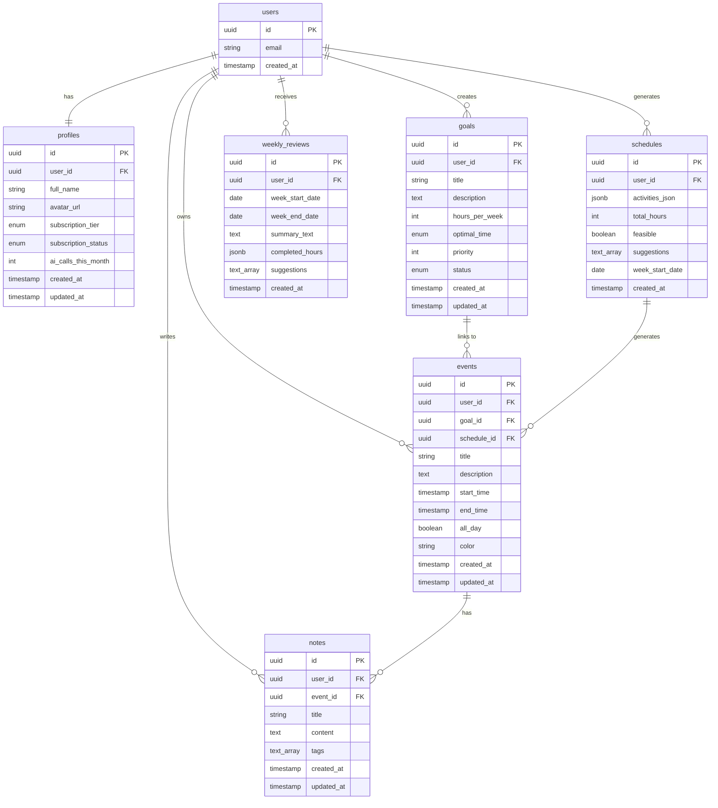

# LifeBalance AI - Data Model

**Date**: 2025-02-13  
**Author**: [Your Name]  
**Database**: PostgreSQL (Supabase)

---

## Entity Relationship Diagram (Mermaid)



---

## Table Specifications

### 1. users (Managed by Supabase Auth)

- **Purpose**: Authentication and user identity
- **Note**: This table is auto-created by Supabase Auth. We do not create it in migrations.

---

### 2. profiles

- **Purpose**: Extended user data and subscription info
- **Indexes**: UNIQUE(user_id), INDEX(subscription_tier, subscription_status)
- **RLS**: Users can only read/update their own profile

---

### 3. goals

- **Purpose**: User's high-level goals (e.g. "App Development", "Poker Grinding")
- **Enums**:
  - `optimal_time`: 'morning' | 'afternoon' | 'evening' | 'flexible'
  - `status`: 'active' | 'paused' | 'completed'
- **Indexes**: INDEX(user_id, status), INDEX(user_id, created_at DESC)
- **RLS**: Users can CRUD their own goals

---

### 4. schedules

- **Purpose**: AI-generated weekly schedules
- **activities_json structure**:

```json
[
  { "name": "App Dev", "hoursPerWeek": 15, "optimalTime": "afternoon" },
  { "name": "School", "hoursPerWeek": 20, "optimalTime": "morning" }
]
```

- **Indexes**: INDEX(user_id, week_start_date DESC)
- **RLS**: Users can CRUD their own schedules

---

### 5. events

- **Purpose**: Calendar time blocks
- **Relationships**: goal_id (optional), schedule_id (optional)
- **Indexes**: INDEX(user_id, start_time), INDEX(goal_id), INDEX(schedule_id)
- **RLS**: Users can CRUD their own events

---

### 6. notes

- **Purpose**: Rich-text notes linked to events or standalone
- **content format**: Markdown or rich text JSON
- **Indexes**: INDEX(user_id, created_at DESC), INDEX(event_id), GIN(tags) for tag search
- **RLS**: Users can CRUD their own notes

---

### 7. weekly_reviews

- **Purpose**: AI-generated weekly performance reports
- **completed_hours structure**:

```json
{
  "App Dev": { "planned": 15, "actual": 12, "percentage": 80 },
  "School": { "planned": 20, "actual": 18, "percentage": 90 }
}
```

- **Indexes**: UNIQUE(user_id, week_start_date)
- **RLS**: Users can read/create their own reviews

---

## Migration

Initial schema is applied via:

- `supabase/migrations/20250213000000_initial_schema.sql`

After applying migrations, generate TypeScript types:

```bash
npx supabase gen types typescript --local > types/database.types.ts
```
