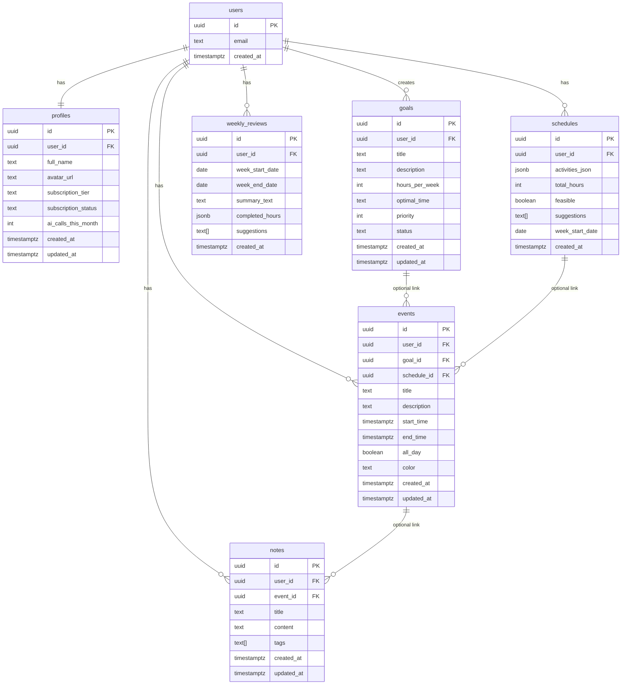

# Mendly - Data Schema

**Date**: 2025-02-13  
**Author**: [Your Name]  
**Project**: Mendly

---

## Core Entities

PostgreSQL-compatible types for Supabase. All `id` (PK) and `*_id` (FK) use `UUID` unless noted.

---

### 1. users

Managed by Supabase Auth. Application schema references this for RLS and FKs.

| Column      | Type        | Constraints        | Description              |
|------------|-------------|--------------------|--------------------------|
| id         | UUID        | PK                 | From Supabase Auth       |
| email      | TEXT        | NOT NULL, unique   | User email               |
| created_at | TIMESTAMPTZ | NOT NULL, default now() | Account creation time |

---

### 2. profiles

Extended user data; one row per user.

| Column              | Type        | Constraints                    | Description                    |
|---------------------|-------------|--------------------------------|--------------------------------|
| id                  | UUID        | PK, default gen_random_uuid()  | Primary key                    |
| user_id             | UUID        | FK → users.id, UNIQUE, NOT NULL| Links to Supabase Auth user    |
| full_name           | TEXT        | NULLABLE                       | Display name                   |
| avatar_url          | TEXT        | NULLABLE                       | Profile image URL              |
| subscription_tier   | TEXT        | NOT NULL, CHECK IN ('free','pro','teams') | Plan tier              |
| subscription_status | TEXT        | NOT NULL, CHECK IN ('active','canceled','past_due') | Billing status   |
| ai_calls_this_month | INTEGER     | NOT NULL, default 0            | AI usage counter (reset monthly)|
| created_at          | TIMESTAMPTZ | NOT NULL, default now()        | Row creation                   |
| updated_at          | TIMESTAMPTZ | NOT NULL, default now()        | Row last update                |

---

### 3. goals

User-defined goals (e.g. “Exercise”, “Learn Spanish”).

| Column        | Type        | Constraints                         | Description                |
|---------------|-------------|-------------------------------------|----------------------------|
| id            | UUID        | PK, default gen_random_uuid()       | Primary key                |
| user_id       | UUID        | FK → users.id, NOT NULL             | Owner                      |
| title         | TEXT        | NOT NULL                             | Goal name                  |
| description   | TEXT        | NULLABLE                             | Optional details           |
| hours_per_week| INTEGER     | NULLABLE, CHECK (>= 0)               | Target hours per week      |
| optimal_time  | TEXT        | NOT NULL, CHECK IN ('morning','afternoon','evening','flexible') | Preferred time block |
| priority      | INTEGER     | NOT NULL, CHECK (priority BETWEEN 1 AND 5) | 1=lowest, 5=highest |
| status        | TEXT        | NOT NULL, CHECK IN ('active','paused','completed') | Goal state   |
| created_at    | TIMESTAMPTZ | NOT NULL, default now()              | Row creation               |
| updated_at    | TIMESTAMPTZ | NOT NULL, default now()              | Row last update            |

---

### 4. schedules

AI-generated weekly schedule (one row per week per user).

| Column          | Type        | Constraints               | Description                              |
|-----------------|-------------|---------------------------|------------------------------------------|
| id              | UUID        | PK, default gen_random_uuid() | Primary key                          |
| user_id         | UUID        | FK → users.id, NOT NULL   | Owner                                    |
| activities_json | JSONB       | NOT NULL                  | Array of {name, hoursPerWeek, optimalTime}|
| total_hours     | INTEGER     | NOT NULL, CHECK (>= 0)    | Sum of scheduled hours                   |
| feasible        | BOOLEAN     | NOT NULL                  | Whether schedule is achievable           |
| suggestions     | TEXT[]      | NULLABLE                  | AI suggestions (e.g. reduce hours)       |
| week_start_date | DATE        | NOT NULL                  | Monday of the week                       |
| created_at      | TIMESTAMPTZ | NOT NULL, default now()   | Row creation                             |

---

### 5. events

Calendar events; may be linked to a goal and/or a schedule.

| Column      | Type        | Constraints               | Description                    |
|-------------|-------------|---------------------------|--------------------------------|
| id          | UUID        | PK, default gen_random_uuid() | Primary key                |
| user_id     | UUID        | FK → users.id, NOT NULL   | Owner                          |
| goal_id     | UUID        | FK → goals.id, NULLABLE   | Optional link to goal          |
| schedule_id | UUID        | FK → schedules.id, NULLABLE | Optional link to schedule   |
| title       | TEXT        | NOT NULL                  | Event title                    |
| description | TEXT        | NULLABLE                  | Event details                  |
| start_time  | TIMESTAMPTZ | NOT NULL                  | Start time                     |
| end_time    | TIMESTAMPTZ | NOT NULL                  | End time                       |
| all_day     | BOOLEAN     | NOT NULL, default false   | All-day event flag             |
| color       | TEXT        | NOT NULL                  | Hex color (e.g. #6366F1)       |
| created_at  | TIMESTAMPTZ | NOT NULL, default now()   | Row creation                   |
| updated_at  | TIMESTAMPTZ | NOT NULL, default now()   | Row last update                |

---

### 6. notes

User notes; optionally attached to an event.

| Column     | Type        | Constraints               | Description              |
|------------|-------------|---------------------------|--------------------------|
| id         | UUID        | PK, default gen_random_uuid() | Primary key          |
| user_id    | UUID        | FK → users.id, NOT NULL   | Owner                    |
| event_id   | UUID        | FK → events.id, NULLABLE  | Optional link to event   |
| title      | TEXT        | NOT NULL                  | Note title               |
| content    | TEXT        | NOT NULL                  | Rich text / Markdown     |
| tags       | TEXT[]      | NOT NULL, default '{}'    | Tags for filtering       |
| created_at | TIMESTAMPTZ | NOT NULL, default now()   | Row creation             |
| updated_at | TIMESTAMPTZ | NOT NULL, default now()   | Row last update          |

---

### 7. weekly_reviews

AI-generated weekly review; one per user per week.

| Column          | Type        | Constraints               | Description                |
|-----------------|-------------|---------------------------|----------------------------|
| id              | UUID        | PK, default gen_random_uuid() | Primary key            |
| user_id         | UUID        | FK → users.id, NOT NULL   | Owner                      |
| week_start_date | DATE        | NOT NULL                  | Monday of the week         |
| week_end_date   | DATE        | NOT NULL                  | Sunday of the week         |
| summary_text    | TEXT        | NOT NULL                  | AI-generated summary       |
| completed_hours | JSONB       | NOT NULL                  | Object: {goalName: hours}  |
| suggestions     | TEXT[]      | NULLABLE                  | AI suggestions             |
| created_at      | TIMESTAMPTZ | NOT NULL, default now()   | Row creation               |

---

## Relationships

| From    | To             | Cardinality | Description                          |
|---------|----------------|-------------|--------------------------------------|
| users   | profiles       | 1:1         | One profile per user                  |
| users   | goals          | 1:N         | User has many goals                   |
| users   | schedules      | 1:N         | User has many schedules (per week)    |
| users   | events         | 1:N         | User has many events                  |
| users   | notes          | 1:N         | User has many notes                   |
| users   | weekly_reviews | 1:N         | User has many weekly reviews          |
| goals   | events         | 1:N (opt)   | Goal can have linked events           |
| schedules | events       | 1:N (opt)   | Schedule can have linked events       |
| events  | notes          | 1:N (opt)   | Event can have linked notes           |

---

## Indexes

| Table          | Index definition                         | Purpose                          |
|----------------|------------------------------------------|----------------------------------|
| profiles       | UNIQUE(user_id)                          | One profile per user; fast lookup|
| goals          | (user_id, status)                        | List goals by user and status    |
| schedules      | (user_id, week_start_date)               | Get schedule for user/week       |
| events         | (user_id, start_time)                    | Calendar queries, date range     |
| notes          | (user_id, created_at)                    | List notes by user, newest first  |
| weekly_reviews | UNIQUE(user_id, week_start_date)         | One review per user per week     |

Suggested index names (optional):

- `idx_profiles_user_id` (unique)
- `idx_goals_user_id_status`
- `idx_schedules_user_id_week_start_date`
- `idx_events_user_id_start_time`
- `idx_notes_user_id_created_at`
- `idx_weekly_reviews_user_id_week_start_date` (unique)

---

## ERD Diagram (Mermaid)

---

## Notes for Implementation

- **RLS**: Enable Row Level Security on all tables; policies should restrict by `user_id` (and `auth.uid()` for users from Supabase Auth).
- **users**: If using Supabase Auth only, `users` may be `auth.users`; in that case, reference `auth.uid()` in FKs and do not duplicate `auth.users` in app schema.
- **Enums**: Consider PostgreSQL `CREATE TYPE` for `subscription_tier`, `subscription_status`, `optimal_time`, `status` to enforce values and improve clarity.
- **Triggers**: Use `updated_at` triggers (e.g. `before update`) for `profiles`, `goals`, `events`, `notes`.
