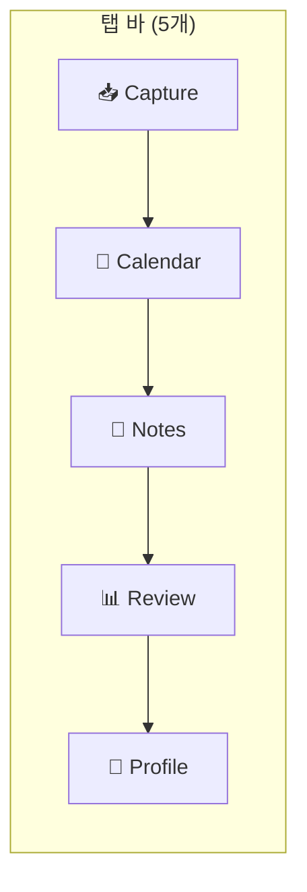
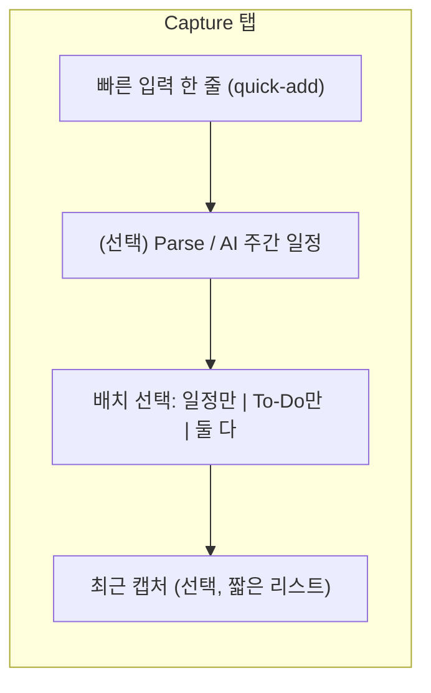
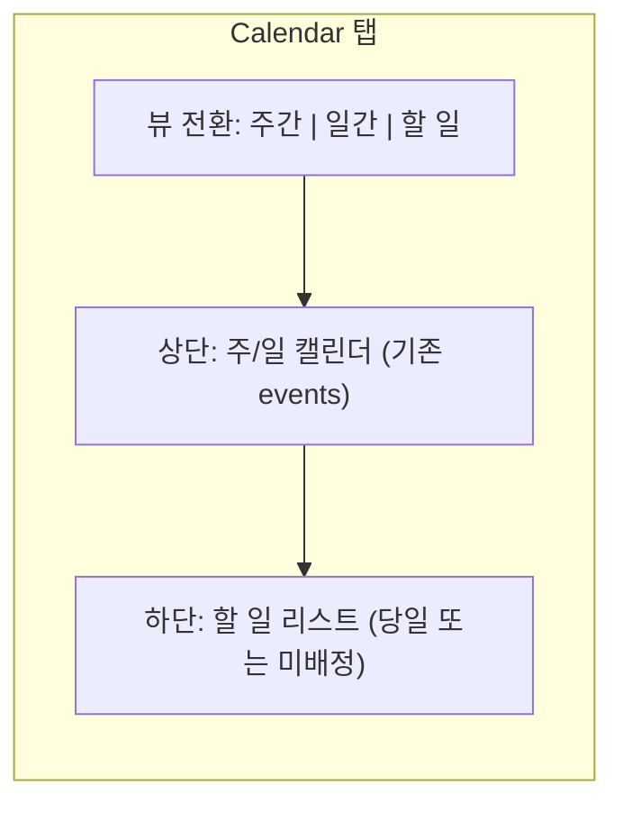
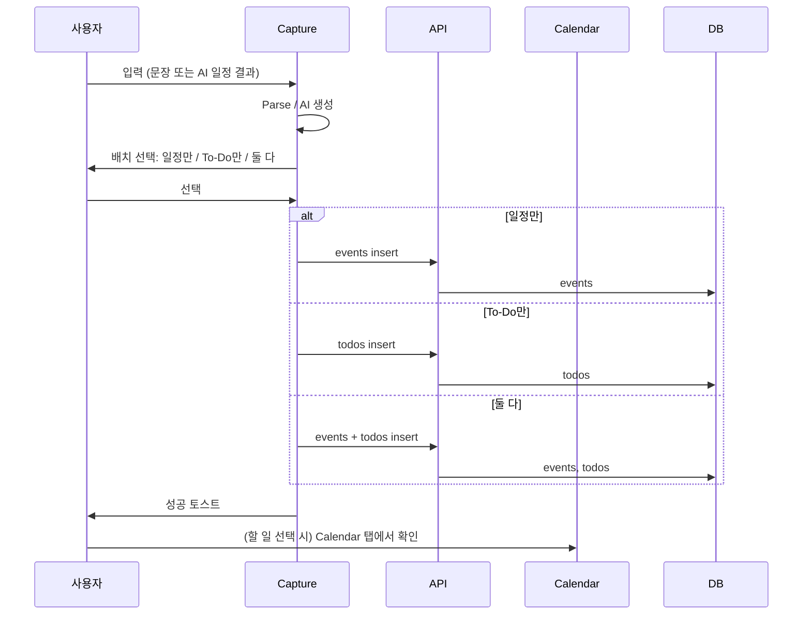

# 캡처·스케줄 통합 + To-Do 리뉴얼 — Design

**Date**: 2026-02-22  
**Author**: PDCA  
**Project**: Mendly (LifeBalanceAI)  
**Plan**: [capture-schedule-todo-renewal.plan.md](../../01-plan/features/capture-schedule-todo-renewal.plan.md)

> **도면 보기**: 이 파일을 VSCode(GitHub)에서 열면 §4의 Mermaid 다이어그램이 렌더링됩니다. §4.5는 ASCII 도면입니다.

---

## Overview

인박스와 스케줄을 **Capture** 하나의 탭으로 합치고, **To-Do** 기능을 추가하며, 생성 시 「일정만 / To-Do만 / 둘 다」 선택이 가능하도록 한다.  
To-Do의 **위치**는 인기 앱 벤치마킹 후 결정한 권장안을 반영한다.

---

## 1. 벤치마킹 — 인기 앱의 To-Do·캘린더 배치

| 앱 | 구조 요약 | To-Do 위치 | 캘린더 위치 | 참고 |
|----|-----------|------------|-------------|------|
| **Todoist** | Inbox / Today / Upcoming | 시간 기준 뷰(Today, Upcoming). 별도 “Calendar” 탭 없음. | Upcoming·필터에서 날짜별 확인 | 캡처(Inbox) → 시간 배치(Today/Upcoming)가 핵심. 탭 수 3개 수준. |
| **TickTick** | 리스트 + 캘린더 뷰 | 리스트/필터와 **같은 앱 내** 캘린더. 뷰 전환(리스트 ↔ 캘린더). | 일정·할 일 모두 캘린더 뷰에 표시 | 할 일과 일정을 **한 화면(캘린더)**에서 같이 보는 패턴. |
| **Google Calendar + Tasks** | 캘린더가 메인 | **캘린더 앱 안** “Tasks” 뷰. 할 일이 캘린더와 연동. | 메인 화면이 캘린더 | 할 일 = 캘린더의 보조 뷰. 탭 추가 없이 캘린더 내 전환. |
| **Apple Reminders** | 사이드바 리스트 | Today / Scheduled / Flagged / All. 캘린더는 별도 “캘린더” 앱. | Reminders 앱에는 캘린더 없음 | 할 일 전용 앱. Mendly는 “일정+할 일” 둘 다 있으므로 직접 대응은 아님. |
| **Weeklo / MightyWeek** | 주간 플래너 | **주간 뷰 아래(또는 옆)** 할 일 목록. 드래그로 요일 배치. | 상단 주간 타임라인, 하단 할 일 | “한 화면에 주간 + 할 일” 조합. 무겁지 않게 한 탭에서 처리하는 패턴. |

**공통 패턴 요약**

- **캡처(입력)** 는 한 곳에 모은다 (Todoist Inbox, Mendly Capture).
- **할 일** 은 (1) **캘린더와 같은 탭**에 두거나 (2) **캘린더 뷰 아래/옆** 리스트로 두는 경우가 많다.
- **할 일 전용 탭**을 하나 더 만들면 탭이 6개로 늘어나 “가벼움” 목표와 맞지 않음.

---

## 2. To-Do 배치 옵션 (4안)

| 옵션 | 설명 | 장점 | 단점 |
|------|------|------|------|
| **A. To-Do 전용 탭** | Capture \| **Todo** \| Calendar \| Notes \| Review \| Profile (6탭) | 할 일만 보고 싶을 때 명확 | 탭 수 유지/증가 → 경량화 위반 |
| **B. Capture 탭 안에 To-Do** | Capture 탭 = 상단 캡처 + “내 할 일” 리스트 섹션 | 캡처 직후 할 일 목록을 같은 탭에서 확인 | “날짜별” 보기는 Calendar와 이중화될 수 있음 |
| **C. Calendar 탭 안에 To-Do** | Calendar 탭 = 상단 주/일 뷰 + **하단 할 일** 리스트(당일 또는 미배정) | Google Calendar·Weeklo처럼 “한 화면에 일정+할 일” | Calendar 탭 복잡도 증가 |
| **D. Calendar + Capture 모두** | Capture에는 “오늘 할 일” 미리보기(3~5개), 전체 목록·완료는 **Calendar 탭** 하단 | 캡처에서 맛보기, 계획은 Calendar에서 | 구현·설명이 다소 복잡 |

---

## 3. 권장안 — **C안: Calendar 탭 안에 To-Do**

**선정 이유**

- 벤치마크에서 **Google Calendar + Tasks**, **TickTick**, **Weeklo** 등이 “캘린더(또는 주간 뷰) + 할 일 리스트”를 **한 탭**에 두는 패턴을 사용함.
- Mendly는 이미 **Calendar** 탭이 있어, 여기에 “할 일” 영역만 추가하면 **탭 수를 5개로 유지**하면서 To-Do를 제공할 수 있음.
- 사용자 인지: “**언제 뭘 할지**” = Calendar 탭 한 곳에서 일정과 할 일을 함께 보는 것이 직관적임.

**결정**

- **To-Do 목록·완료 처리 UI** → **Calendar 탭** 내부 (주/일 뷰 **아래** 또는 세그먼트 “일정 | 할 일” 전환).
- **Capture 탭**에서는 “일정만 / To-Do만 / 둘 다” 선택 후 저장만 하고, 할 일 **목록 화면**은 Calendar에서만 제공.
- 필요 시 Capture 탭에 “오늘 할 일 3개” 정도 **미리보기 링크**만 두어 “Calendar에서 더 보기”로 유도 (D안의 축소판, 선택 구현).

---

## 4. 도면 — 구조·화면 (Mermaid / ASCII)

아래 다이어그램은 VSCode/GitHub 등에서 Mermaid를 지원하면 렌더링되어 도면처럼 볼 수 있다.

### 4.1 탭 바 구조 (리뉴얼 후)



### 4.2 Capture 탭 화면 구성



### 4.3 Calendar 탭 — 일정 + To-Do 통합



### 4.4 생성 플로우 (배치 선택)



### 4.5 ASCII 도면 — Calendar 탭 레이아웃 (할 일 포함)

```
+------------------------------------------+
|  Calendar                        [주간▾]  |
+------------------------------------------+
|  [일정]  [할 일]   ← 세그먼트 또는 탭     |
+------------------------------------------+
|  Mon  Tue  Wed  Thu  Fri  Sat  Sun        |
|  21   22   23   24   25   26   27         |
|  ─────────────────────────────────────   |
|  09:00  회의                               |
|  14:00  운동                               |
|  ...                                      |
+------------------------------------------+
|  오늘의 할 일                             |
|  ☐ 보고서 제출                            |
|  ☐ 장보기                                 |
|  ☑ 이메일 답장                            |
|  + 할 일 추가                             |
+------------------------------------------+
```

---

## 5. 데이터 모델 — To-Do

### 5.1 새 테이블 `todos`

| 컬럼 | 타입 | 설명 |
|------|------|------|
| `id` | uuid | PK, default gen_random_uuid() |
| `user_id` | uuid | FK auth.users, RLS 대상 |
| `title` | text | 할 일 제목 |
| `completed` | boolean | 완료 여부, default false |
| `due_date` | date | (선택) 기한 |
| `event_id` | uuid | (선택) 연동된 event FK. “둘 다”일 때 동일 제목의 event와 연결 |
| `created_at` | timestamptz | 생성 시각 |
| `updated_at` | timestamptz | 수정 시각 |

- **RLS**: `user_id = auth.uid()` 로 본인만 CRUD.
- **인덱스**: `user_id`, `user_id + completed`, `user_id + due_date` (목록·필터용).

### 5.2 기존 테이블과의 관계

- `events`: 기존 유지. “둘 다” 선택 시 `events` 1행 + `todos` 1행 생성. 필요 시 `todos.event_id`로 연결.
- `goals`: To-Do와 별개 유지 (목표 vs 할 일).

---

## 6. API 요약

| 용도 | 방법 | 비고 |
|------|------|------|
| 할 일 목록 조회 | `GET` 또는 Supabase `todos` select (user_id, completed, due_date 필터) | Calendar 탭 하단 리스트 |
| 할 일 생성 | Supabase `todos` insert | Capture에서 “To-Do만 / 둘 다” 시 |
| 할 일 완료 토글 | Supabase `todos` update `completed` | 체크박스 탭 |
| 할 일 삭제 | Supabase `todos` delete | 스와이프 또는 메뉴 |
| 일정 생성 | 기존 `events` insert | “일정만 / 둘 다” 시 |
| Parse / AI 주간 일정 | 기존 `parse-schedule`, `schedule/chat` 재사용 | Capture 탭 내 동일 |

---

## 7. UI 스펙 요약

### 7.1 Capture 탭

- **상단**: 빠른 입력 한 줄 (기존 Inbox quick-add 스타일). placeholder: “할 일이나 일정을 적어 보세요”.
- **액션**: 입력 후 [구조화] 또는 바로 [저장] 시 **배치 선택 모달/바텀시트**: “일정에만 추가” / “할 일만 추가” / “일정 + 할 일 둘 다”.
- **AI 주간 일정**: 기존 Schedule 플로우 유지. 결과 카드에서 “캘린더에 추가” 시 동일하게 배치 선택.
- **최근 캡처**: 제거하거나 5개 이하 짧은 리스트만 (Design에서 선택 구현).

### 7.2 Calendar 탭

- **뷰**: 기존 주간/일간 유지. 상단에 **세그먼트** 또는 탭 추가: “일정” | “할 일”.
  - **일정**: 기존 캘린더 그리드.
  - **할 일**: 당일 또는 “미배정+당일” 할 일 리스트, 체크박스로 완료 토글, “+ 할 일 추가” 버튼.
- 터치 타겟 44pt 이상, v2 색상/타이포/간격 준수.

### 7.3 공통

- 배치 선택 시 로딩 스피너, 성공 시 토스트, 실패 시 Alert + 재시도.
- 다크 모드 대응.

---

## 8. 구현 체크리스트 (Do 단계 참고)

- [ ] **DB**: `todos` 테이블 마이그레이션, RLS, 인덱스.
- [ ] **타입**: `database.types.ts`에 `todos` 반영 (또는 Supabase gen types).
- [ ] **Capture 탭**: `(tabs)/capture.tsx` (기존 inbox + schedule 통합). quick-add, Parse, **배치 선택 UI**, AI 주간 일정 진입.
- [ ] **Calendar 탭**: “할 일” 세그먼트/리스트, 할 일 CRUD, 완료 토글.
- [ ] **라우팅**: `inbox` 제거, `/(tabs)/inbox` → `/(tabs)/capture` 리다이렉트, 탭 바에서 Capture 노출.
- [ ] **i18n**: Capture, To-Do, 배치 선택 문구 (한/영).
- [ ] **Quality**: tsc, lint 통과.

---

## 9. 도면 보기 안내

- **Mermaid**: 이 파일을 VSCode에서 열고 Mermaid 확장을 쓰거나, GitHub에 올리면 다이어그램이 렌더링됩니다.
- **ASCII**: §4.5는 그대로 텍스트로 보면 됩니다.
- **요약**: To-Do는 **Calendar 탭 안**에 두고, Capture에서는 “일정만 / To-Do만 / 둘 다”만 선택하게 하면 됩니다.

---

**Next**: Do — 마이그레이션, Capture 탭 구현, Calendar에 할 일 영역 추가, Inbox 제거 및 리다이렉트.
